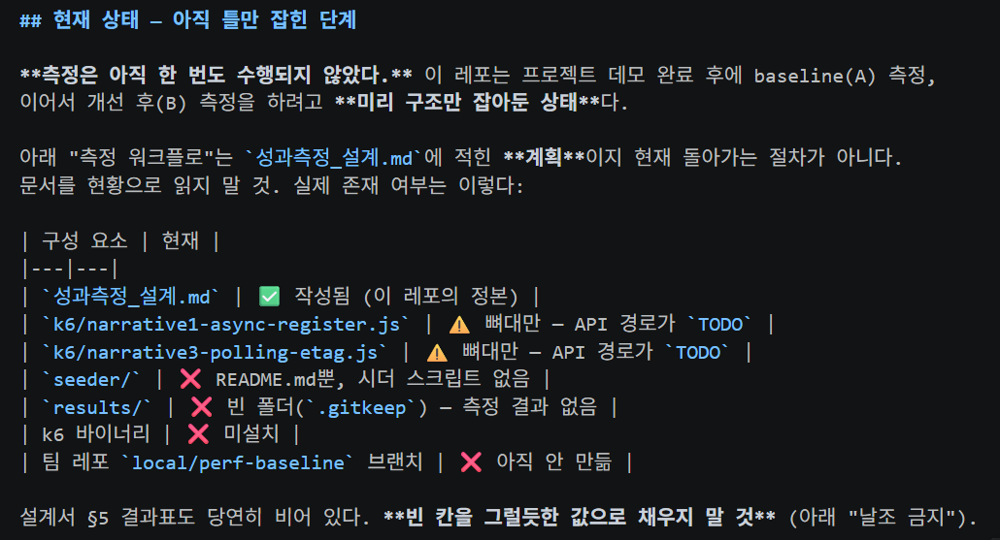
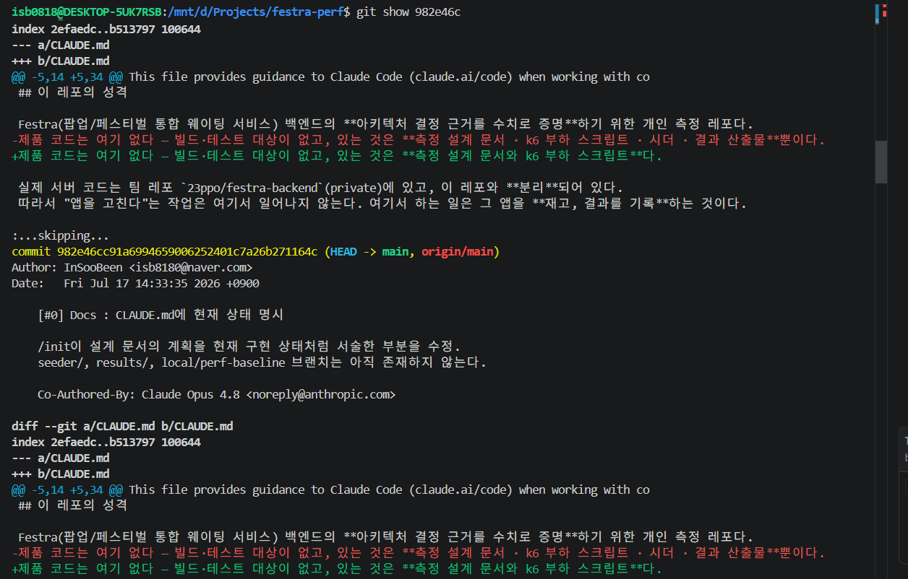

# Week 01 — 설치 & 첫 실습

- 작성자: InSooBeen
- 작성일: 2026-07-17

## 1. 환경 세팅 체크리스트

- [x] 설치 & 로그인 — `claude --version` 정상 출력 + `/login` 완료
- [x] VS Code 연동 — 확장 설치 & `Ctrl+Esc`로 패널 열림
- [x] `CLAUDE.md` 생성 — `/init` 실행해보기 (→ 아래 4번)
- [x] 첫 대화 & 첫 수정 — 프로젝트 설명 받고, diff 수락까지 완료 (→ 아래 3번, 5번)
- [x] git 커밋 위임 — Claude에게 커밋 맡겨보기 (→ 아래 5번, 7번)

## 2. 공식 문서 읽기

- [x] [Quickstart](https://code.claude.com/docs) + CLI 기본 챕터

## 3. 직접 써보기 — GitHub trending 레포 파악하기

### 무엇을 했나

GitHub trending에서 **[stablyai/orca](https://github.com/stablyai/orca)** (TypeScript, 20.5k ★)를 clone한 뒤,
Claude Code에게 "이 프로젝트가 뭐 하는 건지" 파악시킴.
처음 보는 8천 파일짜리 코드베이스를 얼마나 빨리 이해할 수 있는지 보는 게 목적.

### 레포 고른 기준

처음엔 `claude-code-templates`(Claude Code 설정 템플릿 모음)를 후보로 봄.
"Claude Code를 배우는 스터디니까 Claude Code에 관한 레포를 읽으면 되지 않나" 싶었는데,
실제로 열어보니 148MB에 **마크다운 4,080개 / JSON 2,141개 / JS 132개** —
코드베이스가 아니라 카탈로그였음.

그래서 실제 애플리케이션인 orca로 정함. 병렬 에이전트 오케스트레이션이라는 도메인이 낯설어서, 
어떤 프로젝트인지를 파악해보려는 목적에 적합함.

### 파악한 내용

**한 줄 요약**: `Next-gen IDE for parallel agentic development` — 여러 AI 코딩 에이전트를
동시에 돌리는 Electron 데스크톱 IDE.

**핵심 아이디어**: 프롬프트 하나를 여러 에이전트에 뿌리고, 각자 격리된 git worktree에서
작업시킨 다음, 결과를 비교해서 제일 나은 걸 머지함.

**규모**: TypeScript 7,051개 + TSX 1,278개 파일.

**구조** (Electron 프로세스 분리):

| 디렉터리 | 파일 수 | 역할 |
|---|---|---|
| `src/renderer` | 4,261 | UI (React + shadcn) |
| `src/main` | 2,021 | 에이전트·git·PTY 실행 등 실제 작업 |
| `src/shared` | 770 | 양쪽이 함께 쓰는 순수 로직 |
| `src/relay` | 141 | 모바일 앱에서 에이전트 원격 조종 |
| `src/cli` | 123 | CLI 진입점 |

**붙여놓은 연동들** (`src/main` 하위 모듈에서 확인):
- 에이전트: claude, codex, cursor, copilot, gemini, grok, devin, droid, opencode, amp, pi, kimi …
- Git 호스팅: github, gitlab, gitea, bitbucket, azure-devops
- 이슈 트래커: linear, jira

<!-- 스크린샷: orca를 파일 수 기준으로 파악한 Claude Code 응답 -->


### 탐색하면서 배운 것

**코드베이스를 파악하는 방식이 내 방식과 다름.**
나는 보통 README부터 읽는데, Claude Code는 구조를 *세는* 것부터 함:
- 확장자별 파일 수를 세서 "이건 TS 앱이다 / 이건 문서 카탈로그다"를 판정
- 디렉터리별 파일 수로 무게중심 파악
- `src/main` 하위 폴더 이름만 훑어서 지원하는 연동 목록을 추출

README의 홍보 문구가 아니라 파일 구조라는 사실로 프로젝트를 판단하는 게 인상적이었음.
앞서 `claude-code-templates`가 실습에 안 맞는다고 판단한 것도 이 방식으로 나온 결과 (md 4,080 vs js 132).

### 레포 자체에서 발견한 것

**`CLAUDE.md`가 딱 한 줄:**
```
@AGENTS.md
```
Claude Code는 `CLAUDE.md`를, 다른 도구는 `AGENTS.md`를 읽으니까 한쪽을 import로 넘겨서
규칙을 한 파일로 합쳐둔 것임. 여러 에이전트를 지원하는 프로젝트다운 방식이라 메모해둠.

**`AGENTS.md`는 사람이 아니라 AI에게 주는 기여 규칙**
CLAUDE.md에 뭘 써야 하는지 참고가 됨:
- "Document the *Why*, briefly" — 코드가 *뭘 하는지* 말고 *왜 그런지*만, 1~2줄로
- 파일명에 `utils`, `helpers`, `common` 금지
- 크로스 플랫폼: `e.metaKey` 하드코딩 금지, 경로는 `path.join`
- Git 2.25를 호환 기준선으로 삼고 그 이하 버전엔 fallback 유지

## 4. `/init` 실행 — 내 레포에 CLAUDE.md 생성해보기

### 대상 고르기

처음엔 "`/init`이니까 빈 프로젝트에서 해보라는 건가?" 싶었는데 아니었음.
체크리스트가 말하는 건 **`CLAUDE.md`가 없는 상태**에서 만들어보라는 의미인 것 같음.
`/init`이 하는 일 자체가 코드베이스를 훑어서 요약하는 거라, 빈 폴더에 돌리면 껍데기만 나오기 때문.

로컬 프로젝트를 기준으로 스캔해서 고른 결과:

| 후보 | 코드 파일 | CLAUDE.md | 판정 |
|---|---|---|---|
| `sumco` | 0 | 없음 | 분석할 게 없음 |
| `orca` | 8,337 | 있음 | "생성" 경험이 안 됨 |
| `festra-visitor` | 31 | 없음 | 내가 작업한 레포가 아님 → 제외 |
| **`festra-perf`** | **2** | **없음** | **✅ 내 개인 레포** |

`festra-perf`는 Festra 성과 측정용 개인 레포임. 코드는 k6 스크립트 2개뿐이지만
`성과측정_설계.md` 설계 문서가 있고, **앞으로 계속 쓸 내 레포**라 CLAUDE.md가 실제로 남아서 쓸모가 있음.

### 결과 — 설계 문서를 읽고 "왜 존재하는 레포인지"를 잡아냄.

k6 스크립트만 요약하고 끝날 줄 알았는데, 설계서까지 읽고 이런 걸 뽑아냄:

- **레포 성격**: "제품 코드는 여기 없다 — 있는 것은 측정 설계 문서·k6 스크립트·시더·결과물뿐"
- **측정 워크플로**: 팀 레포를 로컬 브랜치로 띄우고 → 시더로 더미 적재 → k6 부하 → 결과표 기입
- **측정 원칙**: 날조 금지 / baseline 먼저 / 같은 조건 / 가정 명시
- **서사 구조**: `narrative<N>` 파일명이 설계서 절 번호와 대응한다는 것까지 연결
- **도메인 경계**: 폴링 엔드포인트는 waiting 도메인 담당 소유라 구현은 협의 대상 —
  그래서 k6 스크립트에 `TODO`가 남아 있다는 인과까지 설명

### 하이라이트 — 시키지도 않은 불일치를 찾아냄.

CLAUDE.md 마지막에 "알려진 불일치" 항목이 붙어 있었음:

> `성과측정_설계.md`는 헤더에 "로컬 전용 문서 (gitignore)"라고 적혀 있으나
> 실제로는 git에 추적 중이고 `.gitignore`에도 없음.

확인해보니 **사실이었음** 문서는 초기 커밋에 이미 들어가 있고, `.gitignore`엔 이 파일이 없음.
설계서를 요약만 한 게 아니라 **문서의 주장을 실제 git 상태와 대조**한 것.

## 5. 첫 수정 — `/init` 결과물의 시제를 고치기

### 발견한 문제: 계획을 현황으로 적어놨다

`festra-perf`는 **프로젝트 데모가 끝난 뒤에** baseline(A) 측정, 이어서 개선 후(B) 측정을 하려고
미리 틀만 잡아둔 레포이며, 측정은 아직 한 번도 안 함.

그런데 `/init`이 만든 CLAUDE.md는 이 레포를 **이미 돌아가는 워크플로처럼** 서술함.
설계서는 "이렇게 잴 것이다"라는 계획서인데, 그걸 "이렇게 잰다"는 현황 설명으로 옮긴 것.

| CLAUDE.md의 서술 | 실제 |
|---|---|
| "`seeder/`로 더미 데이터 적재 (부스 10개 / 대기열 1만+)" | `seeder/`엔 README.md 하나뿐, 시더 없음 |
| "`results/`에 캡처" | `.gitkeep`만 있는 빈 폴더 |
| "팀 레포를 `local/perf-baseline` 브랜치로 체크아웃해 `bootRun`" | 그런 브랜치 없음 |

전부 틀린 건 아니며, "제품 코드는 여기 없다, 빌드·테스트 대상이 없다"는 정확했고,
k6는 **"별도 설치 필요, 현재 환경에 없음"**이라고 직접 확인해서 명시함.
**실행 파일이 있는지는 확인했는데 디렉터리가 비었는지는 확인하지 않은** 것임.

### 왜 이게 사소한 흠이 아닌가

CLAUDE.md는 앞으로 이 레포에서 Claude가 **매번 읽는** 파일임.
계획을 사실처럼 적어두면 다음 세션의 Claude가 "시더가 있다"고 믿고 시작함.
잘못된 전제가 문서에 고정돼서 두고두고 재생산되는 구조임.

### 수정 내용

`festra-perf/CLAUDE.md`에 **"현재 상태 — 아직 틀만 잡힌 단계"** 섹션을 추가하고,
구성 요소별로 실제 존재 여부를 표로 정리함
(설계서 ✅ / k6 스크립트 ⚠️ 뼈대만 / 시더 ❌ / results ❌ / k6 미설치 ❌ / 브랜치 ❌).
나머지 수정은 세 가지:

- `## 측정 워크플로` → `## 측정 워크플로 (계획)` — 계획이라는 걸 제목에 명시
- `## 시더` → `## 시더 (미작성)` 로 바꾸고 "아직 README.md만 있다"를 첫 줄에 추가
- 레포 성격 문단의 "있는 것은 설계 문서·스크립트·**시더·결과 산출물**뿐"에서 없는 항목 제거

<!-- 스크린샷: 첫 수정으로 CLAUDE.md에 추가한 '현재 상태' 표 -->


### 참고 커밋

커밋을 일부러 2개로 나눔. 한 번에 올리면 완성본만 남아서 뭐가 문제였는지가 안 보이기 때문.

<!-- 스크린샷: 두 번째 커밋(982e46c)의 diff -->


두 커밋 모두 Claude에게 위임해서 만듦. (체크리스트 "git 커밋 위임").
다만 `festra-perf`는 private 레포라 링크가 열리지 않을 수 있어, 수정 내용은 위에 표로 옮겨둠.

## 6. 다음 세션 공유거리

### 신기했던 것 — 시키지도 않은 불일치를 찾아냈다

`/init`에게 시킨 건 "코드베이스 요약"인데, 결과물 마지막에 **"알려진 불일치"** 항목이 붙어 있었음:

> `성과측정_설계.md`는 헤더에 "로컬 전용 문서 (gitignore)"라고 적혀 있으나
> 실제로는 git에 추적 중이고 `.gitignore`에도 없음

확인해보니 사실이었으며, 문서를 요약만 한 게 아니라 **문서의 주장을 실제 git 상태와 대조**함.
요약만 해줄 줄 알았는데 검증까지 함.

### 그래서 이해하게 된 것 — `/init`은 언제 쓰는가

여기서 의문이 생김. **`/init`이 프로젝트를 분석해서 CLAUDE.md를 만들어주는 거라면,
개발 자체를 Claude Code로 하는 경우엔 언제 쓰지?** 시작 시점엔 아무것도 없는데.

알고 보니 `/init`은 `npm init` 같은 **프로젝트 초기화**가 아니라, **"있는 걸 읽어서 문서로 뽑기"**임. 읽을 게 없으면 뽑을 것도 없음. 
`/init`을 쓰는 시점은 **처음이 아니라 나중** — 구조가 잡히고 빌드/테스트 명령이 확정된 뒤라고 생각함.

**하지만 초반에 CLAUDE.md가 필요 없다는 것이 아니라, 직접 써야 한다고 생각했음.**

`/init`이 뽑을 수 있는 건 폴더 구조, 빌드 명령, 쓰는 라이브러리처럼 **코드에서 유도되는 것**인데,
그런데 이런 건 Claude가 필요할 때 직접 찾아봐도 됨.
정작 값어치 있는 건 왜 이 스택인지, 뭘 하지 말아야 하는지처럼 **코드를 아무리 읽어도 안 나오는 것**임.

오늘 본 orca가 그 증거이며, 규칙 파일(`AGENTS.md`) 내용이 전부 다음과 같았음:

> - 파일명에 `utils`, `helpers`, `common` 쓰지 마라 — 정보량 0이고 잡동사니 창고가 된다
> - `max-lines` 룰을 disable 하지 마라
> - Git 2.25를 호환 기준선으로 삼고 그 이하 버전엔 fallback을 유지하라
> - 주석은 *뭘 하는지* 말고 *왜 그런지*만, 1~2줄로

`/init`이 코드를 읽어서 뽑아낼 수 있는 게 **거의 없음.** 전부 사람이 정한 정책이며,
성숙한 프로젝트일수록 CLAUDE.md는 `/init` 산출물이 아니라 손으로 쓴 규칙 덩어리가 되는 것 같다는 생각을 함.

그래서 실제로 쓸 순서는 이렇게 정리함:

| 시점 | 할 일 |
|---|---|
| **처음** | CLAUDE.md를 짧게 **직접** 쓰기. |
| **개발하면서** | 같은 지적을 **두 번** 하게 되면 그게 CLAUDE.md 후보. |
| **구조가 잡힌 뒤** | `/init`으로 구조·명령어 같은 기계적인 부분을 채우되, **결과물은 초안이라 검수 필수** |

오늘 `festra-perf`에서 CLAUDE.md가 알차게 나온 것도 같은 이유임.
코드는 k6 스크립트 2개뿐인데 결과가 좋았던 건 `성과측정_설계.md`라는, **내가 미리 써둔 문서**가 있어서임.
`/init`은 코드만 읽는 게 아니라 **쓰여 있는 걸** 읽는다. 설계 문서가 없었다면
"k6 스크립트 2개 있음" 수준으로 끝났을 것임.

**결론: `/init`은 CLAUDE.md를 만드는 방법 중 하나일 뿐이고, 그것도 값싼 절반만 담당함.
이 외에는 처음부터 끝까지 사람의 몫.**

### 이상했던 것 — 계획을 현황으로 옮겨 적었다

같은 `/init`이 정반대 실수도 했다. 설계서에 적힌 **계획**(시더로 적재 → k6 부하 → 결과 캡처)을
현재 돌아가는 **절차**인 것처럼 CLAUDE.md에 써놓음.

**git 추적 상태는 실제로 대조해놓고, 정작 디렉터리가 비었는지는 확인하지 않음.**
확인할 수 있는데 안 한 것이므로 어디까지 검증하고 어디부터 문서를 그냥 믿는지, 그 경계를 예측하기가 어려웠음.

교훈: `/init` 결과물은 **초안이지 완성품이 아님.** 특히 설계 문서가 있는 레포라면
"문서에 적힌 계획"과 "지금 있는 것"을 사람이 갈라줘야 함.

## 7. 덤 — "커밋 위임"이 막혀 있었다

Claude에게 커밋을 시키면 `git add`가 **승인 프롬프트도 없이 그냥 거부**됐다. 디렉터리 권한을 줘도 그대로였음.
같은 폴더에 `touch`로 파일을 만드는 건 됐으니, 쓰기가 되는데 `git add`만 안 되는 상황.

원인 - 내가 예전에 넣어둔 `~/.claude/settings.json`의 안전 룰:

```json
"deny": ["Bash(*dd *)", ...]
```

디스크를 통째로 덮어쓸 수 있는 `dd` 명령을 막으려고 넣은 건데,
이 패턴은 **명령어 단위가 아니라 그냥 문자열 부분 일치**임.

```
git add CLAUDE.md
     ^^^
   "dd " 가 들어있음
```

`add` 안의 `dd`에 걸려서 모든 `git add`가 차단됨.
`deny`는 `ask`와 달리 **묻지 않고 바로 막기 때문에** 프롬프트조차 안 뜸.

검증은 간단했다. `git stage`는 `git add`와 기능이 똑같은 별칭인데 철자에 `dd`가 없음.
그걸로 돌려보니 바로 통과해서 기능이 아니라 **글자** 때문에 막혔다는 것을 확인함.
룰을 `Bash(dd *)` / `Bash(* dd *)` 로 좁히고 나니 `git add`도 정상 동작함.
