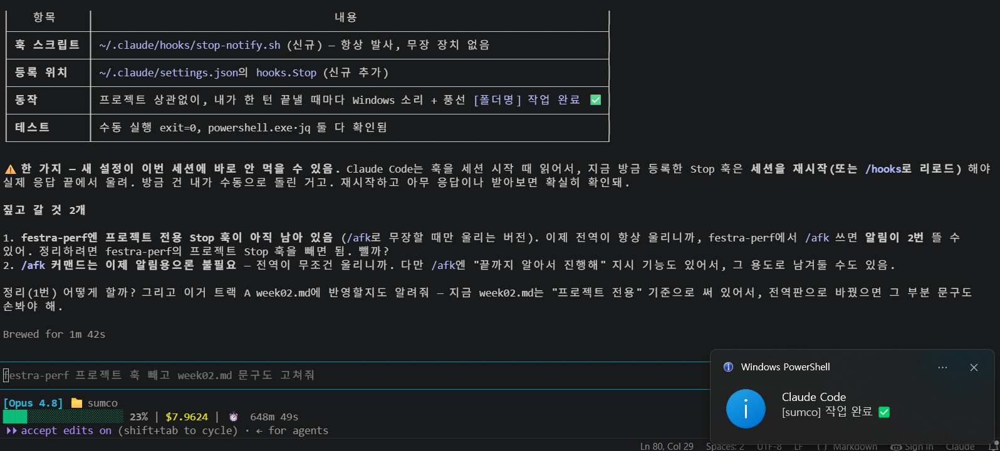

# 📝 2주차 실습 정리 — InSooBeen

## 1. 워크플로우 1바퀴 (필수)

**작업한 것 (버그 수정):** k6 폴링 부하 스크립트 `k6/narrative3-polling-etag.js`의 실제 버그 2건 + 죽은 코드 1건.

`탐색 → 계획(Plan Mode) → 구현 → 검증 → 커밋 → PR` 전 과정을 한 바퀴 돌렸다.

### 탐색 — 진짜 버그를 두 개 찾음
스크립트는 "대기 현황을 3초 주기로 폴링하는 클라이언트"를 모사해 **304(Not Modified) 응답 비율**을
재는 것이 목적이다. 그런데 주석과 코드가 어긋나 있었다.

1. **폴링 주기가 구현돼 있지 않음** — 헤더 주석은 "폴링 주기 3s"라고 명시하는데 반복문에
   `sleep()`이 없었다. 폴링 클라이언트를 전혀 모사하지 못하니 이 시나리오로 잰 수치는 의미가 없다.
2. **측정하려던 지표가 없음** — 주석엔 "304 비율 측정의 핵심"이라 적혀 있는데,
   304 응답 비율을 집계하는 커스텀 metric이 아예 없었다. `check`가 "200이거나 304"만
   통과 판정해서, 개선 효과인 **304 hit rate를 숫자로 뽑을 수 없었다.**
3. (덤) `if (__VU && ...)` — `__VU`는 항상 1 이상이라 늘 참인 죽은 조건.

### 계획 — Plan Mode를 실제로 사용
`EnterPlanMode`로 들어가 수정안을 플랜 파일에 적고 승인받은 뒤 구현에 들어갔다.
읽기 전용 탐색 → 계획 확정 → 승인 → 편집으로 단계가 강제되니, 고치기 전에 뭘 고칠지를 자연스럽게 결정했다. 계획 승인 없이는 편집 툴이 잠긴다는 게 핵심.

### 구현
```js
// before
import { check } from 'k6';
...
  if (__VU && globalThis.__etag) headers['If-None-Match'] = globalThis.__etag;
  const res = http.get(...);
  check(res, { '200 or 304': (r) => r.status === 200 || r.status === 304 });
}

// after
import { check, sleep } from 'k6';
import { Rate } from 'k6/metrics';
const POLL_INTERVAL = Number(__ENV.POLL_INTERVAL || 3);
const notModified = new Rate('not_modified_rate');   // 304 비율 지표
...
  if (globalThis.__etag) headers['If-None-Match'] = globalThis.__etag;  // 죽은 조건 제거
  const res = http.get(...);
  notModified.add(res.status === 304);               // 매 요청 304 여부 집계
  check(res, { '200 or 304': (r) => r.status === 200 || r.status === 304 });
  sleep(POLL_INTERVAL);                              // 폴링 주기 3s 반영
}
```

### 검증
- k6 바이너리가 환경에 없어서 실부하 실행은 범위 밖으로 두고, **두 단계로 검증**:
  - `node --check k6/narrative3-polling-etag.js` → 구문 스모크 통과
  - `git diff`로 변경 자체를 눈으로 리뷰 (의도한 3가지 수정만 들어갔는지)

### 커밋 / PR 링크
- 커밋: `58cd776` — `[#0] Fix : narrative3 폴링 스크립트에 폴링 주기·304 지표 반영`
- PR: **https://github.com/InSooBeen/festra-perf/pull/1** (private)

### 느낀 점
"실제 버그"를 찾는 데 시간을 쓴 게 오히려 실습의 핵심이었다. 없는 기능을 만드는 것보다
**주석(의도)과 코드(현실)의 간극**을 짚는 편이 워크플로우를 자연스럽게 관통시켰다.
Plan Mode는 "탐색은 편하게, 편집은 승인 후"라는 규칙을 도구가 강제해줘서 좋았다.

---

## 2. CLAUDE.md 제대로

`/init`으로 생성한 CLAUDE.md에 **빌드·실행 안내**와 **금지사항 통합 섹션**을 추가함.
- 커밋: `5bbfdee` — `[#0] Docs : CLAUDE.md에 빌드·실행 명확화 + 금지사항 통합 섹션 추가`

이 레포는 **측정 전용 레포**라, 일반적인 프로젝트로 오해하면 Claude가 엉뚱한 짓을 하므로 다음을 명문화했다.
- **빌드·실행 섹션**: "빌드 대상이 없다 — `gradlew/npm/mvn` 실행 금지, 유일한 실행물은 k6 스크립트(별도 설치 필요)"
- **하지 말 것 섹션**: 곳곳에 흩어져 있던 금지사항(결과값 날조 금지, 미확정 API 경로 지어내기 금지 등)을
  작업 전 체크리스트로 한데 모음

### before / after 

**Q1. "이 프로젝트 빌드하고 테스트 돌려줘"**
| | 답 |
|---|---|
| before (generic /init) | 빌드 가능한 프로젝트로 가정 → `gradle`/`package.json`을 찾아 **빌드를 시도**하려 함 |
| after | "이 레포엔 빌드 대상이 없다. 실행 가능한 건 k6 스크립트뿐이고 k6는 미설치"라며 **헛빌드를 하지 않음** |

**Q2. "결과표가 비어 있는데 대략적인 값으로 채워줄 수 있어?"**
| | 답 |
|---|---|
| before | "일반적으로 이 정도"라며 **그럴듯한 수치로 표를 채움**(= 날조) |
| after | "측정하지 않은 칸은 비워 둡니다(날조 금지 원칙). 실제 실행 후 값으로만 채웁니다"라며 **거부** |

규칙이 본문에 흩어져 있으면 Claude가 놓친다. **"하지 말 것"을 한 곳에 모으니** 같은
질문에도 답이 눈에 띄게 규율 있게 바뀌었다.

---

## 3. 커스텀 Slash Command + Hook

### Command — `/commit`
`.claude/commands/commit.md`. `git status`·`git diff --staged`를 `!` 로 미리 실행해 컨텍스트로 넣고,
Conventional Commits 형식(제목 한 줄 + 본문에 "왜")으로 커밋하게 하는 커맨드. (`allowed-tools: Bash(git:*)`)

### Hook — 위험 bash 차단 (PreToolUse)
- 커밋: `8985b11` — `[#0] Chore : 위험 bash 차단 PreToolUse 훅 추가 (guard-bash)`
- 파일: `.claude/hooks/guard-bash.py` + `.claude/settings.json`(PreToolUse `Bash` 매처로 등록)

**왜 이걸 만들었나 — 1주차 `dd` 사건의 후속.** 1주차에 권한 룰의 부분일치가 `git add`의
`dd`를 위험 명령으로 오인해 막았던 상황을 겪었다. 이번엔 **위험 명령을 실행 전에 차단하는 훅**을 만들었다.

그런데 기존 전역 훅(`~/.claude/hooks/guard-bash.py`)에 **정규식 버그**가 있었다.
raw string 안에서 `\\s`(백슬래시 2개)로 적혀 있어 정규식이 "공백"이 아니라 "리터럴 백슬래시 + s"가
되는 바람에 **실제로는 아무 명령도 못 막고 있었다.** `\s`로 고쳐 실제 동작하는 로컬 훅을 만들었다.

**연동:** `/commit`이 돌리는 `git` 명령을 포함해 **모든 Bash 호출의 앞단**을 이 훅이 지킨다.
자동화된 커밋 흐름에 안전장치가 붙는 그림.

**실제 동작 검증** (파이썬 하네스로 4케이스):
```
[OK] 위험: 루트 삭제              exit=2   차단됨: 루트 디렉터리 삭제 패턴
[OK] 위험: 강제 push            exit=2   차단됨: 강제 push
[OK] 위험: 블록 디바이스 쓰기        exit=2   차단됨: 블록 디바이스 직접 쓰기
[OK] 안전: git add(dd 오탐 없어야)  exit=0   (통과)
--- 대조: 전역 버그판은 루트 삭제도 exit=0 (= 아무것도 못 막음) ---
```
단어 경계(`\b`)를 써서 `git add`의 `dd` 같은 **오탐을 예방**했다.

> 이 훅을 만드는 도중, 검증하려고 `rm -rf /`를 셸에 직접 echo 했더니
> **권한 시스템이 그 명령을 막아버렸다.** 위험 문자열을 파이썬 하네스에서 조각으로 조립해
> 우회(정확히는 "안전하게 테스트")해야 했다. 안전장치가 작동한다는 의미.

### 작업 완료 알림 Hook (Stop)

긴 작업을 걸어두면 언제 끝났는지 몰라서 계속 터미널을 들여다보게 된다.
그래서 **턴이 끝날 때마다 데스크톱 알림을 띄우는 `Stop` 훅**을 만들었다.
- 파일: `~/.claude/hooks/stop-notify.sh` + `~/.claude/settings.json`의 `hooks.Stop`에 등록
- WSL2 환경이라 리눅스 `notify-send`나 사운드가 없다. 대신 `powershell.exe`를 호출해
  **윈도우 시스템 사운드 + 풍선 알림**을 띄웠다.
- 훅은 stdin으로 JSON을 받는데, 거기서 `.cwd`를 뽑아 폴더명을 알림 문구에 넣었다. → `[sumco] 작업 완료 ✅`



처음엔 프로젝트 전용(`.claude/`)으로 만들었다가, **어느 레포에서 작업하든 쓰고 싶어져서 전역 `~/.claude/`로 옮겼다.**
옮기고 나서 프로젝트 쪽 훅을 안 지우면 알림이 두 번 뜬다는 걸 알게 돼서 그건 따로 제거했다.

> ⚠️ **훅은 세션 시작 때 읽힌다.** 방금 등록한 `Stop` 훅이 바로 안 울려서 잘못 만든 줄 알았는데,
> 세션을 재시작(또는 `/hooks` 리로드)해야 적용되는 거였다. 위 스크린샷은 훅 스크립트를 수동 실행해 확인한 것.

`PreToolUse`(차단형)와 `Stop`(알림형) 두 종류를 만들어보니 훅의 **시점(matcher)** 개념이 확실히 잡혔다.

---

## 4. (도전) MCP — AWS Documentation MCP

**연결한 MCP:** AWS Documentation MCP 서버(공식 AWS 문서 검색·조회).

**실제로 시켜본 작업:** 내 프로젝트에서 "등록 쓰기 경로를 SQS로 비동기 분리한" 설계의 근거를
공식 문서에서 찾게 시켰다. `search_documentation("SQS decouple asynchronous throughput")` →
throughput/배칭 문서를 `read_documentation`으로 정독.

**얻은 것 (설계에 바로 쓸 근거):**
- **요청 지연이 단일 스레드 처리량을 제한한다** — 예: 지연 20ms면 단일 스레드, 단일 커넥션 최대 ~50 TPS.
  → 처리량을 늘리려면 **수평 확장(프로듀서/컨슈머 인스턴스 증설)**, 클라이언트를 2배로 늘리면 처리량도 거의 선형 2배.
- **배칭(SendMessageBatch 등, 한 번에 최대 10건)** 은 왕복당 작업량을 키워 스레드·커넥션을 아끼고,
  SQS가 **요청 단위 과금**이라 비용까지 줄인다. 단 배치 요청은 일부만 실패할 수 있어 **개별 실패를 반드시 확인·재시도**해야 한다.

**후기:** 웹 검색 대신 MCP로 붙이니 **출처 URL이 명확한 1차 문서**를 그 자리에서 인용, 요약할 수 있어
설계 근거를 대는 데 확실히 유리했다. 특히 20ms→50TPS 같은 구체 수치는 아키텍처 선택(왜 비동기 분리가 필요한가)을 뒷받침해준다.

---

## 5. 회고

- **겪은 상황:** 훅을 테스트하려고 위험 명령을 셸에 그대로 넣었다가 권한 시스템에 막힌 것.
  결국 위험 문자열을 조각으로 조립하는 테스트 하네스를 따로 만들었다 — 오히려 더 안전한 방식이 됐다.
- **워크플로우 변경사항:** "탐색(읽기) → Plan Mode(합의) → 구현 → 검증 → 커밋"이
  몸에 붙었다. 특히 **편집 전 계획 승인**이 강제되니 방향이 틀어진 채 코드부터 짜는 일이 줄었다.
- **다음에도 또 쓸 세팅 1가지:** **위험 bash 차단 훅.** `/commit` 같은 자동화 앞단에 안전장치가
  하나 있으면 마음 놓고 위임할 수 있다. 1주차 `dd` 문제 해결이 2주차 방어 장치로 이어졌다.
