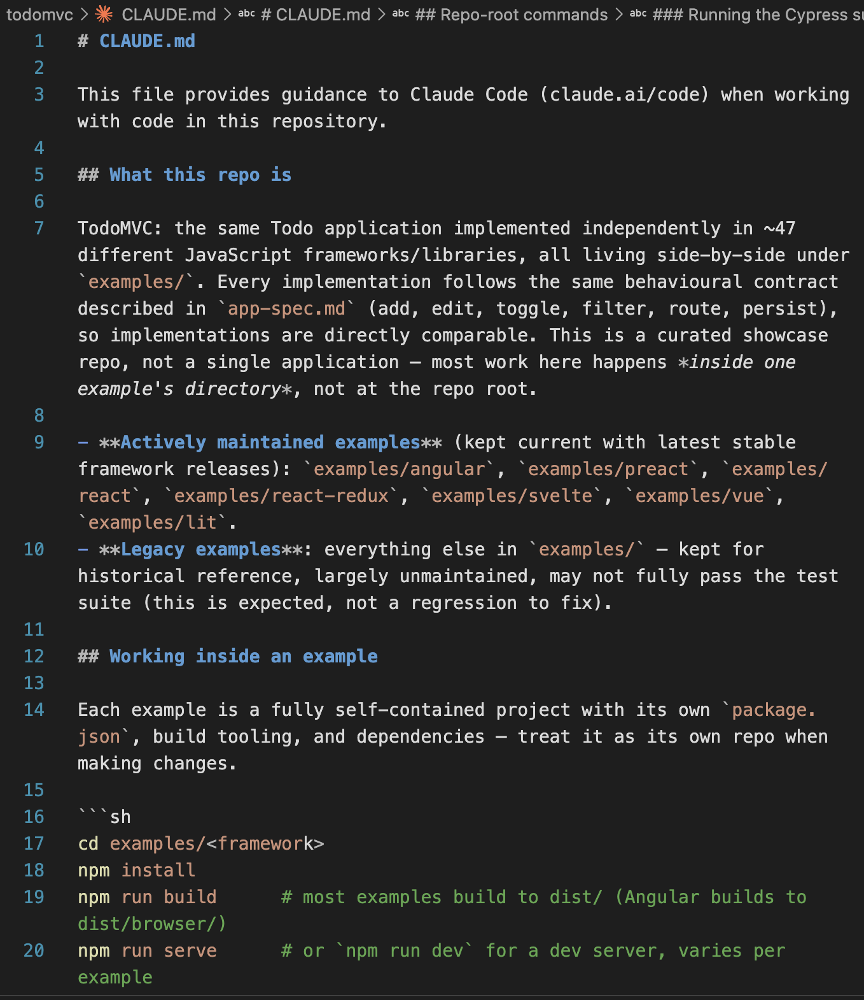
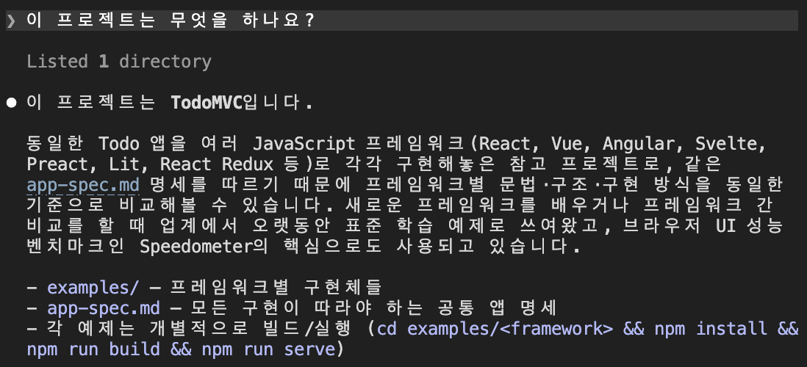
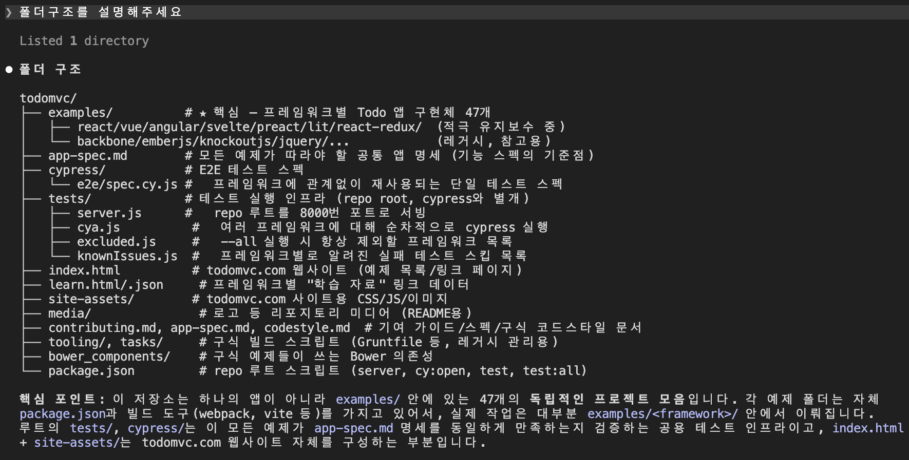
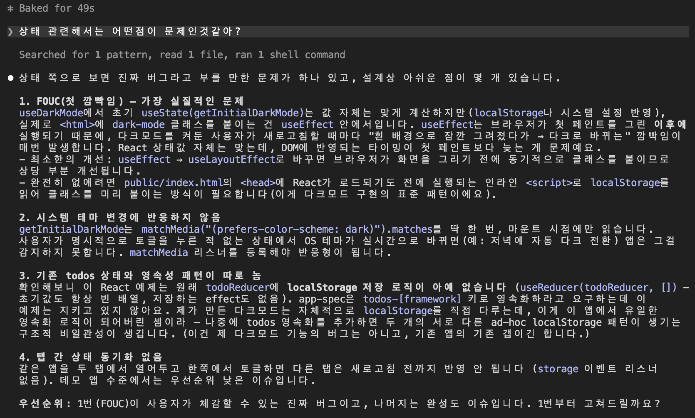
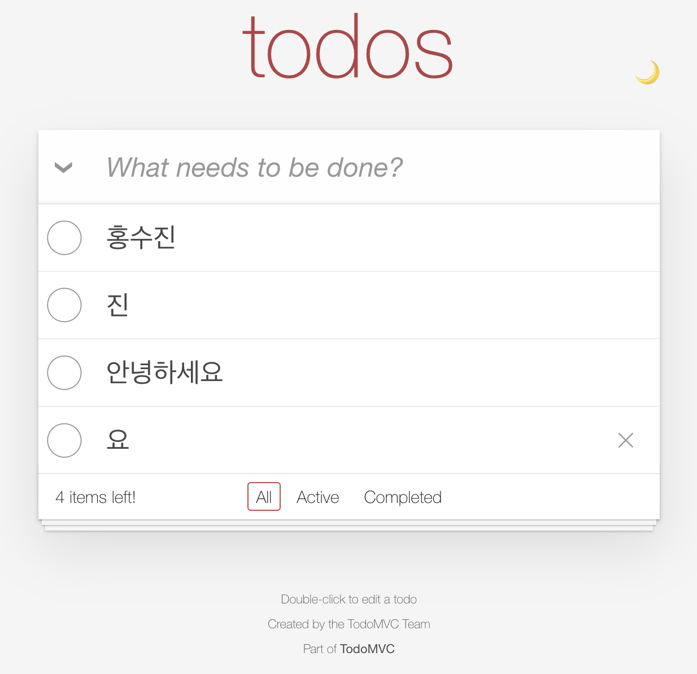
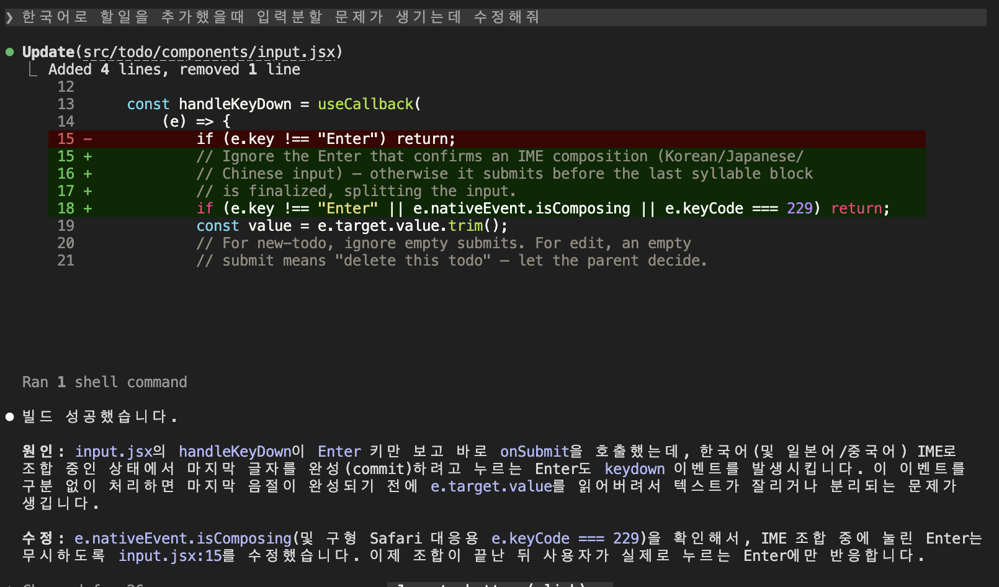
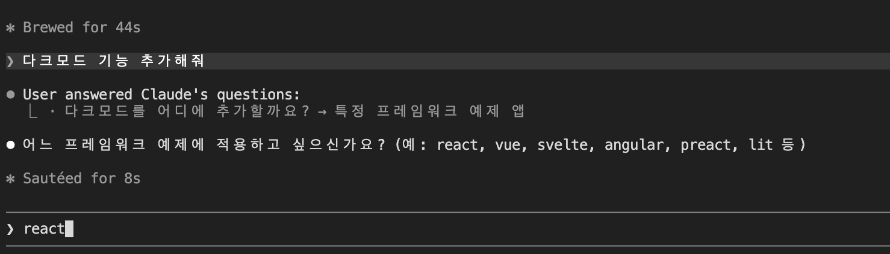
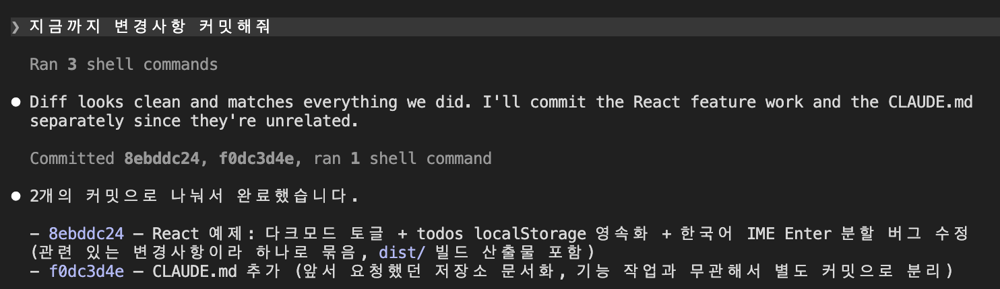

# Claude Code 1주차 실습

[x] 설치 & 로그인 — claude --version 정상 출력 + /login 완료
[x] VS Code 연동 — 확장 설치 & Cmd+Esc(Win: Ctrl+Esc)로 패널 열림
[x] CLAUDE.md 생성 — /init 실행해보기
[x] 첫 대화 & 첫 수정 — 프로젝트 설명 받고, diff 수락까지 완료
[x] git 커밋 위임 — Claude에게 커밋 맡겨보기

## 프로젝트

- **프로젝트명**: TodoMVC
- **GitHub**: https://github.com/tastejs/todomvc

### 프로젝트 설명

TodoMVC는 동일한 To-Do List 애플리케이션을 React, Vue, Angular, Svelte 등 다양한 JavaScript 프레임워크로 각각 구현하여 비교할 수 있도록 만든 오픈소스 프로젝트입니다.

### 프로젝트 선정 과정

처음에는 GitHub Trending에서 규모가 큰 프로젝트를 선택했는데, 서버 구성과 API Key를 발급받아 환경 변수에 등록해야 하는 등 사전 준비가 필요해 바로 실행하기 어려웠습니다.

그래서 실행 환경이 비교적 간단한 TodoMVC 프로젝트를 선택하여 실습을 진행했습니다.

---

# 1. CLAUDE.md 생성

프로젝트 루트에서 `/init` 명령어를 실행하여 `CLAUDE.md`를 생성했습니다.

> /init
> 

# 2. 프로젝트 파악

프로젝트를 수정하기 전에 Claude에게 프로젝트를 먼저 분석하도록 요청했습니다.

> 이 프로젝트는 무엇을 하나요?

> 폴더 구조를 설명해 주세요.

---

# 3. 작은 수정

## 상태 영속성 문제

프로젝트를 직접 실행해 본 결과, 새로고침을 하면 Todo의 상태가 초기화되는 문제를 발견했습니다.

단순히 **"상태 영속성 문제를 해결해 주세요."** 라고 요청하는 대신,

> 현재 프로젝트에서 가장 큰 문제가 무엇이라고 생각하나요?

라고 질문하며 Claude가 스스로 문제를 찾아낼 수 있는지 테스트해 보았습니다.

처음에는 UI 관련 개선 사항을 먼저 제안했지만, **'상태'** 라는 키워드를 추가로 입력하자 상태 관리와 관련된 여러 문제점을 함께 분석해 주었습니다.

제가 생각했던 **상태 영속성 문제**뿐만 아니라, 제가 미처 발견하지 못했던 개선 사항도 함께 제안해 주는 점이 인상적이었습니다.

---

## 한국어 입력 분할 문제

한국어 입력이 의도와 다르게 분리되는 문제도 함께 확인했습니다.

Claude는 가능한 원인과 수정 방향을 제안해 주었고, 문제를 하나씩 좁혀가며 해결하는 과정이 자연스러웠습니다.

---

# 4. 기능 추가

> 다크모드 기능 추가해줘.

TodoMVC는 여러 프레임워크가 함께 있는 프로젝트인데, Claude는 바로 코드를 수정하지 않고 **프로젝트 전체에 적용할지, 특정 프레임워크에만 적용할지** 먼저 질문했습니다.

기존에 사용했던 AI들은 요청을 그대로 수행하는 경우가 많았는데, Claude는 프로젝트의 구조와 맥락을 먼저 이해한 뒤 작업을 진행하는 점이 인상적이었습니다.

---

# 5. Git 커밋

---

# Claude Code를 사용하며 느낀 점

Claude를 사용하면서 가장 인상 깊었던 점은 **다음 작업을 먼저 제안해 준다는 점**이었습니다.

기존에는 개발자가 필요한 작업을 하나씩 직접 요청해야 했다면, Claude는 현재 작업의 맥락을 이해한 뒤 다음 작업 방향을 먼저 제안해 주었습니다. 사용자는 Yes/No만 선택하면 작업을 이어갈 수 있었기 때문에 반복적으로 명령을 입력해야 하는 부담이 줄어들었습니다.

반면 아쉬웠던 점도 있었습니다.

현재 대화형 제안 기능은 영어를 중심으로 제공되는 경우가 많아 영어에 익숙하지 않은 저에게는 제안 내용을 이해하는 데 다소 시간이 걸렸습니다. 한국어 지원이 확대된다면 더욱 편리하게 사용할 수 있을 것 같습니다.

또 하나 아쉬웠던 점은 **터미널에 표시되는 Yes/No 선택 UI가 사라지면 이전 제안 내용을 다시 확인하기 어렵다는 점**이었습니다.

실수로 잘못 선택했거나 이전 제안을 다시 확인하고 싶을 때 별도로 확인할 수 있는 방법이 없어 다소 불편하게 느껴졌습니다. Git을 이용해 변경 사항을 확인하거나 되돌리는 방법밖에 없는 것인지 궁금했으며, 이번 경험을 통해 **작업 단위마다 커밋을 자주 남기는 습관이 중요하다는 점**을 다시 한번 느낄 수 있었습니다.
