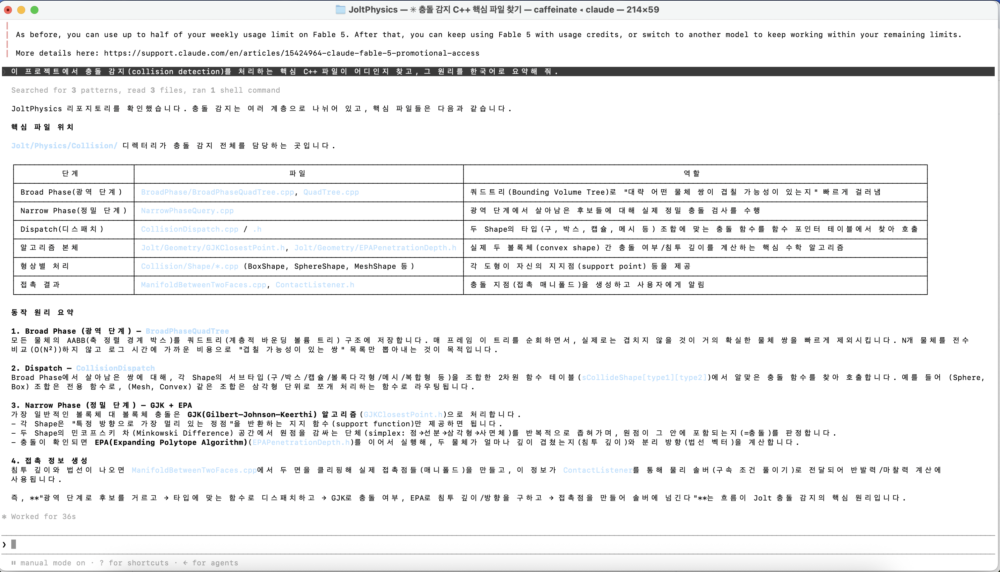
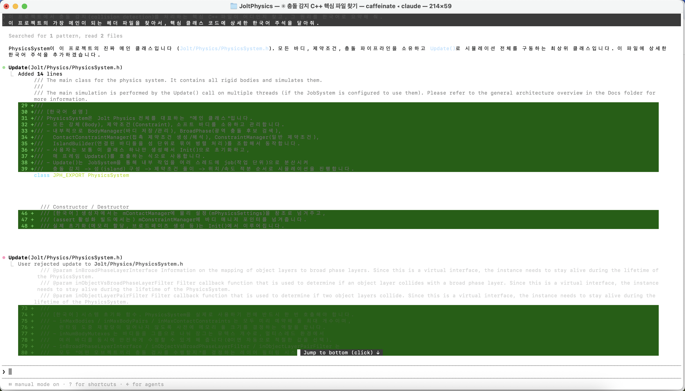

## ✅ 1주차 과제 체크리스트

### 1. 환경 세팅 완료
- [x] 설치 & 로그인 (claude --version + /login)
- [x] VS Code 연동 완료
- [x] CLAUDE.md 생성 완료
- [x] 첫 대화 & 첫 수정 완료
- [x] git 커밋 위임 완료

### 2. 공식 문서 읽기
- [x] Quickstart + CLI 기본 챕터 읽기 완료

### 3. 직접 써보기
- **선택한 프로젝트**: `jrouwe/JoltPhysics` (https://github.com/jrouwe/JoltPhysics)
- **시킨 작업**: 
  1. 프로젝트 내에서 충돌 감지(collision detection)를 처리하는 핵심 C++ 파일을 찾고, 그 동작 원리를 한국어로 요약해달라고 요청했습니다.
  2. 프로젝트의 가장 메인이 되는 헤더 파일을 찾아서, 핵심 클래스 코드에 상세한 한국어 주석을 달아달라고 요청했습니다.
- **결과**: 
  - `Jolt/Physics/Collision/` 디렉터리 내의 파일들을 분석하여 Broad Phase(광역 단계), Narrow Phase(정밀 단계) 등 충돌 감지 원리를 표와 함께 요약해 줌.
  
  

  - 메인 클래스인 `PhysicsSystem.h`를 스스로 찾아내서, 클래스의 전반적인 역할과 초기화 흐름을 설명하는 한국어 주석을 코드 라인에 맞춰 작성하고 diff로 띄워줌.
  
  

### 4. 다음 세션 공유거리
- **신기했던 것**: 남이 짠 방대한 코드를 처음 열어보면 어디서부터 봐야 할지 막막한데, 클로드를 이용해 알아서 핵심 파일만 뽑아 구조를 표로 요약해 주는 게 너무 편리하다는 생각이 들었습니다. 앞으로 전공 수업이나 프로젝트를 진행하며 낯선 코드를 분석할 때 활용하면 큰 도움이 될 것 같습니다. 또한 코드의 맥락을 스스로 파악해 한국어 주석을 달고 즉시 diff로 보여주는 과정이 매우 인상적이었습니다.
- **이상했던 것**: 터미널 환경에서 코드를 수정하고 diff를 수락(Accept)하거나 거절(Reject)하는 과정이 아직 툴에 익숙하지 않아 다소 어색했습니다. 주석 결과를 확인하다가 실수로 키를 잘못 눌러 'User rejected update'가 발생하며 수정 내역이 날아가는 경험을 했는데, 터미널 UI의 단축키와 조작 방식은 조금 더 사용하며 적응해야 할 것 같습니다.