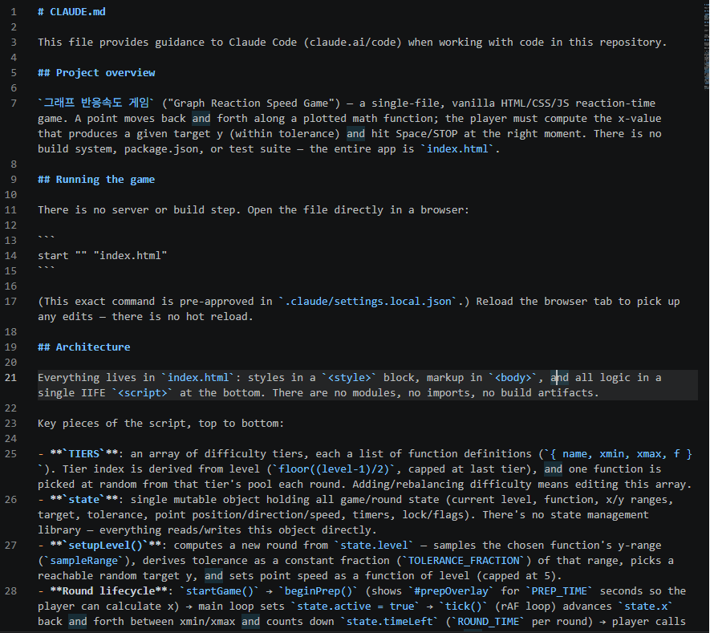
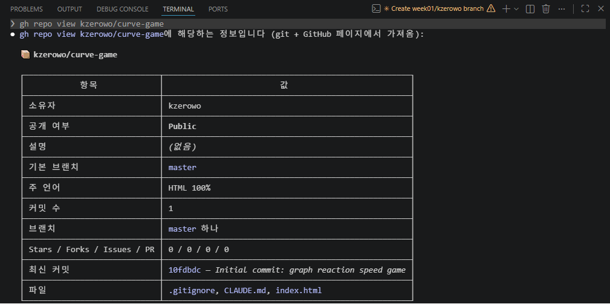

# Week 01 - Claude Code 설치 & 첫 실습

## 체크리스트 진행 상황

### 1. 환경 세팅
- [x] 설치 & 로그인 — `claude --version` 정상 출력 + `/login` 완료
- [x] VS Code 연동 — 확장 설치 & `Ctrl+Esc`로 패널 열림
- [x] `CLAUDE.md` 생성 — `/init` 실행
- [x] 첫 대화 & 첫 수정 — 프로젝트 설명 받고, diff 수락까지 완료
- [x] git 커밋 위임 — Claude에게 커밋 맡겨봄 (GitHub CLI 연동으로 저장소 생성/커밋/푸시)

### 2. 공식 문서 읽기
- [x] Quickstart + CLI 기본 챕터 읽기

### 3. 직접 써보기
- [x] Claude Code로 프로젝트 하나 건드려보기 (curve-game 신규 제작)

### 4. 다음 세션 공유거리
- [x] 신기했던 것 1개
- [x] 이상했던 것 1개

## 직접 써본 프로젝트 & 시킨 작업

`curve-game`: 수학 함수(y=1/x, y=x^2, y=sin(x) 등) 그래프 위에서 목표 y값을 맞추는 반응속도 게임을 단일 `index.html` (vanilla JS + canvas)로 제작.

- Claude Code에게 게임 규칙(함수 랜덤 선택, 목표 y값 제시, 커서 이동, STOP 타이밍 판정, 레벨업 구조)을 자연어로 설명하고 전체 구현을 맡김
- `/init` 명령으로 `CLAUDE.md` 자동 생성 → 프로젝트 구조(`TIERS`, `state`, `setupLevel()` 등)를 자동으로 문서화

- GitHub CLI 연동을 통해 저장소 생성부터 커밋, 푸시까지 진행 — `gh repo view kzerowo/curve-game` 실행 결과, 저장소 소유자/공개여부/기본 브랜치/커밋 내역까지 CLI만으로 한 번에 확인 가능했음

저장소 링크: https://github.com/kzerowo/curve-game

## 신기했던 것

`/init`으로 생성된 `CLAUDE.md` 덕분에 다른 세션/채팅을 새로 열어도 Claude Code가 코드 구조(핵심 함수, 상태 관리 방식 등)를 이미 파악한 상태로 시작해서 수정 작업이 훨씬 수월했다. 또한 GitHub CLI를 통해 직접 저장소를 만들지 않아도 Claude Code가 알아서 리포지토리 생성부터 커밋, 푸시까지 처리해준 점이 인상적이었다.

## 이상했던 것

레벨이 올라갈수록 난이도(속도) 증가가 체감상 너무 급격하거나 반대로 완만하게 느껴졌다. `setupLevel()`의 레벨별 속도 공식이 실제 플레이 체감과 균형이 맞지 않았던 것으로 보인다.
