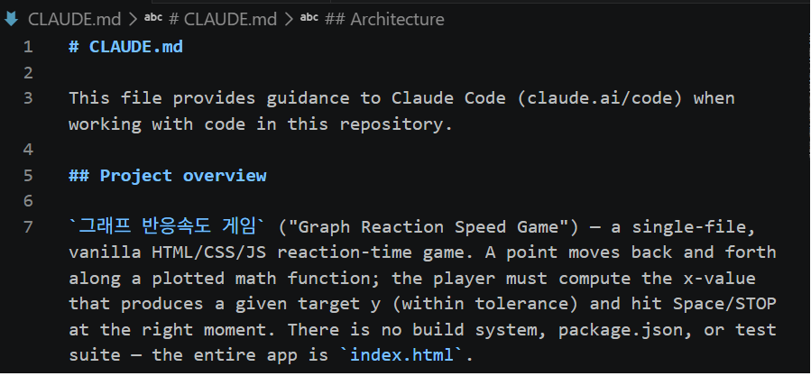
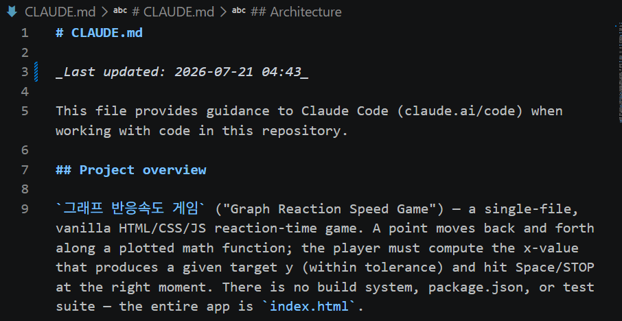

# 📝 2주차 실습 정리 — kzerowo

## 1. 워크플로우 1바퀴 (필수)

- 작업한 것 (기능 개발 or 버그 수정):
  - 버그 수정: 스페이스바 키 반복(auto-repeat) 이벤트 처리 누락
  - `그래프 반응속도 게임` (`index.html`)의 `keydown` 리스너가 `e.repeat`를 체크하지 않아, 스페이스바를 길게 누르고 있으면 브라우저의 키 auto-repeat 이벤트마다 `handleAction()`이 계속 재호출됨
  - 특히 게임오버 상태에서 스페이스바를 누르고 있으면 `startGame()`이 반복 호출되어, 키를 떼기 전까지 다음 라운드가 사실상 시작되지 못하는 문제였음
- 과정: 탐색 → 계획(Plan Mode) → 구현 → 검증(테스트) → 커밋 → PR
  - **탐색**: `index.html` 전체(약 590줄) 구조를 읽고 게임 상태 머신(`state` 객체), 라운드 라이프사이클(`setupLevel` → `beginPrep` → `tick` → `attemptStop`/`triggerTimeout`), 입력 처리(`handleAction`) 흐름을 파악
  - **계획**: 수정 범위가 1줄이라 별도 Plan Mode 없이 바로 구현 가능하다고 판단
  - **구현**: `handleAction()` 호출 직전에 `if (e.repeat) return;` 추가. 단, 페이지 스크롤 방지용 `e.preventDefault()`는 반복 이벤트에도 계속 호출되도록 유지
  - **검증**: 브라우저에서 `index.html`을 직접 열어 (1) STOP 타이밍에 스페이스바를 길게 눌러도 한 번만 반응하는지, (2) 게임오버 후 스페이스바를 길게 눌러도 재시작이 한 번만 일어나는지 수동 테스트로 확인
  - **커밋**: 브랜치 `fix/space-key-repeat` 생성 후 커밋
  - **PR**: GitHub에 브랜치 푸시 후 PR 생성
- 커밋 / PR 링크:
  - 커밋: https://github.com/kzerowo/curve-game/commit/ed251d6
  - PR: https://github.com/kzerowo/curve-game/pull/1
- 느낀 점:
  - 그동안은 눈에 보이는 버그만, 그것도 발견된 이후에야 처리해왔는데, 이번엔 "탐색"부터 시작하는 워크플로우 덕분에 스스로도 모르고 있던 버그(스페이스바 auto-repeat 문제)를 찾아낼 수 있었음
  - 평소엔 계획 없이 바로 코드부터 짜다가 작업이 꼬이는 경우가 많았는데, 탐색 → 계획 → 구현 순서를 지키니 오히려 전체 작업 시간이 줄어드는 느낌을 받음

## 3. 커스텀 Slash Command + Hook

- 만든 커맨드 (`.claude/commands/...`):
  - (아직 진행 안 함)
- 만든 Hook (전역 `~/.claude/settings.json`):
  1. **Stop 훅 — 완료 알람**: Claude가 응답을 끝낼 때마다 PowerShell `[console]::beep`으로 알림음 재생
  2. **PreToolUse 훅 — 커밋 전 CLAUDE.md 자동 최신화**: `git commit` 명령을 실행하려는 순간 가로채서, 서브 에이전트(`type: agent`)가 먼저 `git diff --staged` / `git status`로 staged 변경사항을 확인 → 프로젝트 루트의 CLAUDE.md가 없으면 `/init`처럼 새로 생성하고, 있으면 변경사항 기준으로 관련 섹션만 최신화. 이미 최신 상태면 내용은 건드리지 않음
     - 추가 요구사항: CLAUDE.md 맨 첫 줄에 항상 `_Last updated: YYYY-MM-DD HH:MM_` 형식으로 이번 커밋 시점의 날짜/시간을 기록하도록 지시. 내용 변경이 없어도 이 날짜 줄만큼은 매 커밋 시 갱신됨
  - 두 훅 모두 프로젝트 단위가 아니라 `~/.claude/settings.json`에 넣어서 앞으로 작업하는 모든 프로젝트에 공통 적용되도록 함
- 어떻게 연동했나:
  - `PreToolUse` 이벤트 + `matcher: "Bash"` + `if: "Bash(git commit *)"` 조합으로, "Bash 도구가 실행되려는 시점" 중에서도 명령어가 `git commit`으로 시작할 때만 훅이 걸리게 필터링
  - 커밋 전/후 CLAUDE.md 상단 날짜 갱신 결과 비교:
    - 변경 전: 
    - 변경 후: 

## 4. (도전) MCP / Plugin

- 연결한 MCP 서버 or 설치한 플러그인:
  - GitHub MCP 서버 (`github/github-mcp-server`)
- 실제로 시켜본 작업 & 후기:
  - 목표는 "MCP 서버로 PR 조회하기". 최종적으로 GitHub MCP 서버를 통해 PR 상세 조회에 성공함
  - 
  - 후기: MCP는 "서버 연결"이라는 한 단계처럼 보이지만 실제로는 (1) 서버 등록 (2) 인증 토큰 발급·등록 (3) 실행 환경(터미널 vs VS Code 등)별 스코프 확인까지 최소 3단계를 다 맞춰야 작동한다는 걸 몸으로 배움

## 5. 회고

- 겪은 삽질:
  - MCP 서버는 등록만 하면 바로 쓸 수 있을 거라 생각했는데, 실제로는 GitHub Personal Access Token을 별도로 발급받아 등록해야 했고, 이 사실을 모른 채 시간을 많이 씀
  - 401에러가 떠 연결이 안 될 때 Claude Code가 "세션을 재시작하라"고만 반복 안내해서 원인 파악이 늦어짐
  - 알고 보니 터미널에서 실행한 Claude Code와 VS Code 확장(같은 PC, 같은 프로젝트)이 서로 다른 MCP 설정(스코프)을 참조하고 있어서, 한쪽에 등록한 MCP 서버가 다른 쪽에서는 보이지 않는 현상이었음. `claude mcp add`의 스코프 개념을 몰라서 헤맴
- 워크플로우가 어떻게 바뀌었나:
  - CLAUDE.md의 효과를 생각보다 크게 체감함. 노트북과 데스크탑을 오가며 작업하다 보니 커밋 내용은 받아와도 Claude Code 세션이 이전 맥락을 헷갈려하는 경우가 있었는데, CLAUDE.md가 자동으로 최신화되니 그런 현상이 눈에 띄게 줄어듦
  - Stop 훅 알림음 덕분에 Claude가 작업을 끝낼 때까지 화면만 보고 기다리지 않고 다른 일을 병행할 수 있게 되어 작업 효율이 올라감
  - CLAUDE.md 맨 위에 찍히는 업데이트 날짜를 보면, 코드를 다시 뒤지지 않아도 "최근에 무슨 작업을 했었는지"가 머릿속에 바로 떠오르는 효과도 있었음
- 다음에도 또 쓸 세팅 1가지:
  - 다음 주차부터 본격적으로 프로젝트 작업에 들어가면 "무엇이 완료됐고 지금 무엇이 진행 중인지"를 파악하는 게 가장 중요해질 것으로 예상됨. 이번에 만든 커밋 전 CLAUDE.md 자동 최신화 훅을 계속 활용해서, 나와 Claude Code 세션 모두가 현재 진행 상황을 항상 최신 상태로 빠르게 파악할 수 있도록 쓸 계획
